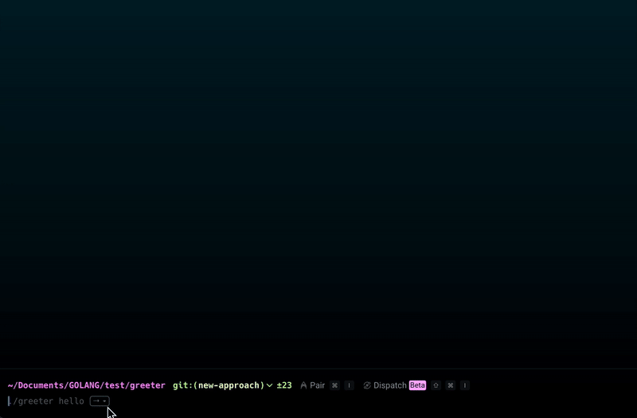

# Greeter - A Multilingual Greeting Application

Greeter is a command-line application that provides greetings in multiple languages through a plugin-based architecture. It has a plugin architecture that allows languages to be either:
- Built-in (embedded) directly into the main application
- External as separate programs that can be loaded on demand

This design is similar to how database drivers work in Go or how [containerd's fuse-overlayfs](https://github.com/containerd/fuse-overlayfs-snapshotter/?tab=readme-ov-file#setup) works, giving users flexibility in how they deploy and use the application.



## Overview

The Greeter application allows users to get greetings like "hello", "good morning", etc. in different languages. It has a modular architecture with:

- A core application that handles user input and manages plugins
- Support for languages through in-process or separate process plugins
- A plugin system based on gRPC for inter-process communication

## How It Works
When a user requests a greeting in a specific language:

- The system first checks if the language is available as an embedded plugin
- If not found, it attempts to load and start an external plugin process
- It then forwards the greeting request to whichever implementation was found
- The result is displayed to the user with nice formatting
- This architecture allows for a clean separation between the core application and language implementations while providing flexibility in deployment.

## Architecture


The system follows a pattern similar to Go's database drivers:

- Core Interface: All language implementations adhere to a common plugin interface
- Registry: A central registry manages embedded language plugins
- Plugin Manager: Handles discovery, launching, and communication with external plugins
- Unified Codebase: Same language implementations work for both embedded and external plugins

## Plugin Communication

External plugins communicate with the main application using gRPC over stdin/stdout. The protocol is defined in greeter.proto.

When a plugin starts, it:
1. Initializes the gRPC server
2. Writes its process ID to stdout for the main app to track
3. Listens for incoming gRPC requests
4. Processes greeting requests and returns appropriate responses

## Building the Project

### Prerequisites

- Go 1.23 or later
- Make

### Build Instructions

1. Clone the repository:
   ```bash
   git clone https://github.com/unsuman/greeter.git
   cd greeter
   ```

2. Build the project using `Make`:
   ```bash
   make all # Builds all the binaries(main + plugins)
   
   make build-english # Builds with English(embedded) only, others as external plugins
   make build-all # Embeds all the languages(No plugins required)

   ```

## Usage

### Basic Commands

```bash
# Get a greeting in English (default, built-in)
./bin/greeter hello

# Get a greeting in Hindi(plugin)
./bin/greeter hello --lang=hindi

# Get a greeting in Japanese(plugin)
./bin/greeter hello --lang=japanese

# List available languages
./bin/greeter list-languages

# Get a greeting in English(default), Hindi, Japanese(built-in)
./bin/greeter-all hello # For English
./bin/greeter-all hello --lang=hindi # For Hindi
./bin/greeter-all hello --lang=japanese # For Japanese

# Get other greetings
./bin/greeter goodmorning [--lang=language]
./bin/greeter goodafternoon [--lang=language]
./bin/greeter goodnight [--lang=language]
./bin/greeter goodbye [--lang=language]
```

## Current Limitations

1. **Basic Error Handling**: Error handling is minimal, especially for plugin communication failures.
2. **Limited Configuration**: Plugin parameters cannot be configured without modifying the source code.
3. **No Plugin Persistence**: When you use a language plugin, it stops when the main program ends.

## Adding New Language Plugins

To create a new language plugin:

- Create a new language implementation in `plugins/[language]/pkg/`
- Implement the Plugin interface
- Add auto-registration code
- Create an external plugin main file
- Update the build system to include your language


